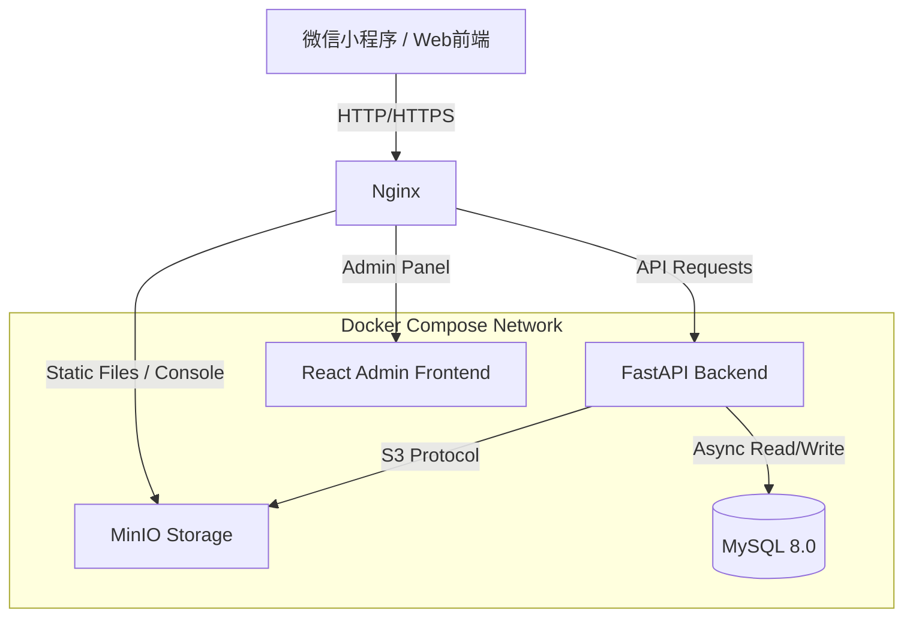

# MakersHub Backend

[](https://www.python.org/)
[](https://fastapi.tiangolo.com/)
[](https://www.mysql.com/)
[](https://www.docker.com/)
[](LICENSE)

MakersHub 是一个现代化的社团管理系统后端，旨在为高校社团和社区组织提供高效、可扩展的管理解决方案。基于 FastAPI 构建，集成了微信小程序生态，提供活动管理、成员管理、物资管理等全方位功能。

---

## 📑 目录

- [功能特性](#-功能特性)
- [技术栈](#-技术栈)
- [系统架构](#-系统架构)
- [项目结构](#-项目结构)
- [快速开始](#-快速开始)
  - [环境要求](#环境要求)
  - [Docker 部署 (推荐)](#docker-部署-推荐)
  - [本地开发](#本地开发)
- [API 文档](#-api-文档)
- [配置说明](#-配置说明)
- [贡献指南](#-贡献指南)
- [许可证](#-许可证)

---

## ✨ 功能特性

- **多端支持**: 完美支持微信小程序端用户交互与 Web 端后台管理。
- **用户认证**: 基于 JWT 的安全认证机制，支持微信一键登录与管理员账号体系。
- **对象存储**: 集成 MinIO，提供高效的图片、海报、资料等文件存储与访问服务。
- **社团管理**: 支持社团创建、审核、成员角色权限管理。
- **活动运营**: 提供活动发布、报名、签到、海报生成等完整生命周期管理。
- **数据导出**: 支持 Excel 格式的数据导出，便于线下统计与归档。
- **高性能**: 基于全异步 (AsyncIO) 的 FastAPI 框架与 SQLAlchemy 2.0，轻松应对高并发场景。

---

## 🛠 技术栈

### Backend
- **Core Framework**: [FastAPI](https://fastapi.tiangolo.com/)
- **ASGI Server**: [Uvicorn](https://www.uvicorn.org/)
- **ORM**: [SQLAlchemy 2.0](https://www.sqlalchemy.org/) (Async)
- **Database Driver**: [aiomysql](https://github.com/aio-libs/aiomysql)
- **Data Validation**: [Pydantic](https://docs.pydantic.dev/)

### Infrastructure & DevOps
- **Containerization**: Docker & Docker Compose
- **Database**: MySQL 8.0
- **Object Storage**: MinIO (S3 Compatible)
- **Logging**: Loguru
- **Reverse Proxy**: Nginx (Optional / Production)

### Admin Frontend
- **Framework**: React
- **Runtime**: Node.js

---

## 🏗 系统架构



---

## 📂 项目结构

```text
makershub-backend/
├── admin-frontend/      # React 管理后台前端代码
├── app/                 # 后端核心代码
│   ├── core/            # 核心配置 (Config, Security, Events)
│   ├── models/          # SQLAlchemy 数据模型
│   ├── routes/          # API 路由定义
│   ├── services/        # 业务逻辑层
│   ├── schemas/         # Pydantic 数据验证模型
│   ├── main.py          # 应用入口
│   └── tasks.py         # 异步任务
├── assets/              # 静态资源 (默认图片等)
├── data/                # 数据持久化目录 (MySQL, MinIO)
├── docker/              # Docker 初始化脚本
│   ├── mysql/           # MySQL 初始化 SQL
│   └── minio/           # MinIO 初始化脚本
├── logs/                # 应用日志
├── docker-compose.yml   # 容器编排文件
├── Dockerfile           # 后端镜像构建文件
├── pyproject.toml       # Python 项目配置
├── requirements.txt     # Python 依赖列表
└── .env                 # 环境变量配置
```

---

## 🚀 快速开始

### 环境要求

- **Docker**: 20.10+
- **Docker Compose**: 2.0+
- **Python**: 3.9+ (仅本地开发需要)

### Docker 部署 (推荐)

这是最快启动完整开发环境（包括数据库、MinIO、后端和管理后台）的方法。

1.  **克隆仓库**
    ```bash
    git clone https://github.com/your-repo/makershub-backend.git
    cd makershub-backend
    ```

2.  **配置环境变量**
    复制示例配置并按需修改：
    ```bash
    cp .env.example .env
    ```
    > ⚠️ 注意：首次启动建议保持默认配置，生产环境请务必修改 `SECRET_KEY` 和数据库密码。

3.  **启动服务**
    ```bash
    docker-compose up -d --build
    ```

4.  **访问服务**
    - **API 文档**: [http://localhost:8000/docs](http://localhost:8000/docs)
    - **管理后台**: [http://localhost:3001](http://localhost:3001)
    - **MinIO 控制台**: [http://localhost:9001](http://localhost:9001) (账号/密码: `minioadmin`/`minioadmin`)

5.  **查看日志**
    ```bash
    docker-compose logs -f backend
    ```

### 本地开发

如果你需要调试后端代码而不希望重启容器：

1.  **启动基础设施** (MySQL & MinIO)
    ```bash
    docker-compose up -d mysql minio
    ```

2.  **创建虚拟环境**
    ```bash
    python -m venv venv
    source venv/bin/activate  # Linux/macOS
    # venv\Scripts\activate   # Windows
    ```

3.  **安装依赖**
    ```bash
    pip install -r requirements.txt
    ```

4.  **启动后端**
    ```bash
    uvicorn app.main:app --reload --host 0.0.0.0 --port 8000
    ```

---

## 📖 API 文档

MakersHub 自动生成交互式 API 文档，启动服务后即可访问：

- **Swagger UI**: [http://localhost:8000/docs](http://localhost:8000/docs) - 适合调试和测试 API。
- **ReDoc**: [http://localhost:8000/redoc](http://localhost:8000/redoc) - 适合阅读和查阅 API 定义。

---

## ⚙️ 配置说明

主要配置项位于 `.env` 文件中，关键配置如下：

| 变量名 | 说明 | 默认值 |
| :--- | :--- | :--- |
| `DATABASE_URL` | MySQL 连接字符串 | `mysql+aiomysql://...` |
| `SECRET_KEY` | JWT 加密密钥 | `ChangeMe` |
| `MINIO_ENDPOINT` | MinIO 内部地址 | `minio:9000` |
| `MINIO_PUBLIC_URL` | MinIO 外部访问 URL | `http://localhost:9000` |
| `WX_APP_ID` | 微信小程序 AppID | - |
| `WX_APP_SECRET` | 微信小程序 Secret | - |

---

## 🤝 贡献指南

1.  Fork 本仓库。
2.  创建你的特性分支 (`git checkout -b feature/AmazingFeature`)。
3.  提交你的更改 (`git commit -m 'Add some AmazingFeature'`)。
4.  推送到分支 (`git push origin feature/AmazingFeature`)。
5.  开启一个 Pull Request。

---

## 📄 许可证

本项目采用 [MIT 许可证](LICENSE)。
